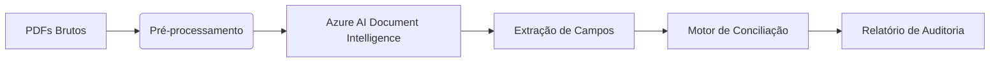

# Stack Audit

[](https://www.python.org/)
[](https://learn.microsoft.com/azure/ai-services/document-intelligence/)
[](https://opensource.org/licenses/MIT)
[]()
[](https://casahacker.org)

**Auditoria financeira inteligente para organizações de impacto social.**

O **Stack Audit** extrai, classifica e reconcilia automaticamente informações de notas fiscais, comprovantes de pagamento, boletos e recibos — mesmo aqueles gerados por aplicativos como Uber e 99.  
Ele transforma pilhas de PDFs desorganizados em dados estruturados prontos para auditoria, usando o poder do **Azure AI Document Intelligence**.

## Por que o Stack Audit?

Organizações da sociedade civil lidam com grande volume de documentos financeiros. A conciliação manual é lenta, propensa a erros e desvia energia de atividades‑fim.

O Stack Audit resolve isso ao:

- **Compreender a estrutura** de notas fiscais, boletos e recibos com **Azure AI Document Intelligence**
- **Extrair campos com precisão** usando modelos pré‑treinados e customizados
- **Casar pagamentos** com os respectivos documentos fiscais
- **Gerar relatórios** de auditoria e inconsistências automaticamente

Ele foi projetado como uma ferramenta **open source** e extensível e modificável para ser integrada às tecnologias de qualquer OSC que tenha infraestrutura e aplicações em nuvem.

## Arquitetura simplificada



- **Pré‑processamento**: Converte páginas em imagens e ignora conteúdo corrompido.
- **Document Intelligence**: Aplica modelos pré‑treinados (notas fiscais, boletos) e customizados conforme o tipo de documento.
- **Motor de Conciliação**: Cruza pagamentos com notas fiscais usando chaves como valor, data e CNPJ.
- **Relatório**: Dados consolidados em CSV/JSON e dashboards prontos para conferência.

## Funcionalidades

- **Extração de notas fiscais de serviço (NFS‑e)** – modelo pré‑treinado + customizado
- **Leitura de boletos bancários** – captura linha digitável, valor e vencimento
- **Interpretação de recibos de reembolso** – Uber, 99, recibos de PIX, via modelo customizado
- **Conciliação automática** – associa cada pagamento à sua nota fiscal
- **Exportação para CSV, JSON e Excel**
- **Suporte a múltiplos formatos de entrada**: PDF, imagens (JPG/PNG)
- **CLI amigável e biblioteca Python reutilizável**
  
## Começando

### Pré‑requisitos

- Python **3.10** ou superior
- Conta no **Microsoft Azure** com o recurso **Azure AI Document Intelligence** criado
- Chave de acesso e endpoint do serviço.

### Instalação

```bash
git clone https://github.com/casahacker/stack-audit.git
cd stack-audit
python -m venv venv
source venv/bin/activate  # Linux/Mac
venv\Scripts\activate     # Windows
pip install -r requirements.txt
```

### Configuração

Copie o arquivo de ambiente de exemplo e edite com suas credenciais:

```bash
cp .env.example .env
```

Conteúdo do `.env`:

```ini
DOCUMENT_INTELLIGENCE_ENDPOINT=https://seu-endpoint.cognitiveservices.azure.com/
DOCUMENT_INTELLIGENCE_KEY=xxxxxxxxxxxxxxxxxxxxxxxxxxxxxxxx
```

### Uso rápido (CLI)

```bash
# Analisar uma única nota fiscal
stack-audit analyze nota-fiscal ./caminho/para/nf.pdf

# Analisar um lote de recibos de Uber/99
stack-audit analyze reembolso ./pasta/com/recibos/

# Conciliação completa de um período
stack-audit reconcile --data-inicial 2026-02-01 --data-final 2026-02-28
```

Você também pode importar os componentes como biblioteca Python:

```python
from stack_audit import extractor, reconciler

dados_nf = extractor.run("caminho/nf.pdf", tipo="nota_fiscal")
resultado = reconciler.conciliate(periodo="02/2026")
print(resultado.summary())
```

## Estrutura do Projeto

```plaintext
stack-audit/
├── cli.py                   # Ponto de entrada da linha de comando
├── src/
│   ├── extractors/          # Adaptadores para Document Intelligence
│   ├── reconciler/          # Lógica de conciliação e matching
│   ├── preprocess/          # Limpeza, OCR e normalização
│   └── report/              # Geradores de relatório (CSV, JSON, Excel)
├── tests/
├── .env.example
├── requirements.txt
└── README.md
```

## Exemplos de saída

### Comprovante de reembolso (Uber)

Entrada: `recibo_uber.pdf` (imagem)  
Saída (JSON):

```json
{
  "nome": "Maria Silva",
  "cpf": "***.494.721-**",
  "data": "2025-10-30",
  "valor": 119.90,
  "aplicativo": "Uber",
  "tipo": "reembolso",
  "confianca": 0.98
}
```

### Conciliação mensal

| Data       | Favorecido                       | NF nº | Valor NF | Valor Pago | Status     |
|------------|----------------------------------|-------|----------|------------|------------|
| 03/09/2025 | Maria Silva                      | 107   | 4715.00  | 4715.00    | ✅ OK      |
| 03/09/2025 | Carlos Souza                     | 26    | 2800.00  | 2800.00    | ✅ OK      |
| 11/02/2026 | Pedro Santos                     | –     | –        | 74.82      | ⚠️ sem NF  |

## Contribuindo

Contribuições são muito bem‑vindas! Consulte nosso [Guia de Contribuição](CONTRIBUTING.md) para saber como sugerir melhorias, relatar bugs ou enviar pull requests.

Precisamos especialmente de:

- Testes com documentos reais
- Melhorias no motor de conciliação
- Implementação de novos extratores (bancos, cartões, etc.)
- Interface web simples para uso não‑técnico

## Licença

Este projeto é distribuído sob a licença MIT. Veja o arquivo [LICENSE](LICENSE) para mais detalhes.

## ❤️ Agradecimentos

- **Casa Hacker** – idealizadora e mantenedora do projeto
- **Microsoft Azure** – pelos créditos de API e suporte técnico
- **Comunidade open source** – que torna possível ferramentas como essa
